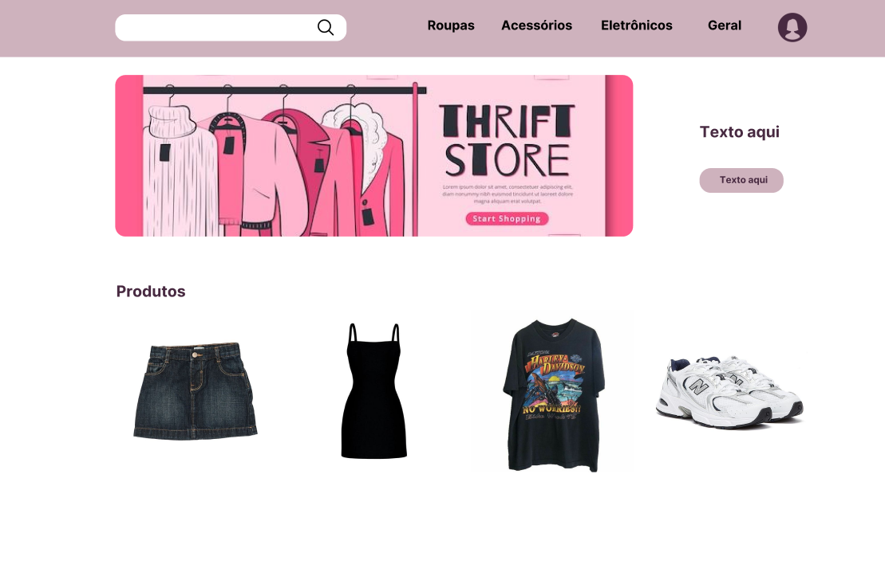

# BuddieBag — Plataforma de Doação e Troca de Itens  

## 1) Problema  
Muitas pessoas acumulam objetos em casa que não usam mais, enquanto outras poderiam reutilizá-los.  
Em comunidades e universidades, isso gera desperdício e dificuldade em encontrar quem precise dos itens.  
Isso causa acúmulo desnecessário, impacto ambiental e gastos evitáveis.  
No início, o foco será **estudantes universitários** com o objetivo de **facilitar o compartilhamento de objetos e reduzir o desperdício**.  

---

## 2) Atores e Decisores (quem usa / quem decide)  
**Usuários principais:**  
- Pessoas que querem desapegar de itens (doadores).  
- Pessoas que procuram itens usados (receptores).  

**Decisores/Apoiadores:**  
- Comunidade acadêmica.  
- Professores da disciplina.  

---

## 3) Casos de uso (de forma simples)  
- **Todos:** Logar/deslogar do sistema; Manter dados cadastrais.  
- **Doadores:** Manter (inserir, mostrar, editar, indisponibilizar) seus itens cadastrados.  
- **Receptores:** Pesquisar e visualizar itens disponíveis; manifestar interesse em um item.  
---

## 4) Limites e suposições  

- **Limites:**  
  - Deploy acadêmico, sem preocupação com alta disponibilidade ou escalabilidade.  

- **Suposições:**  
  - Os usuários terão **acesso à internet** para utilizar o sistema.  
  - O banco de dados padrão será o **PostgreSQL**, acessado pelo **pgAdmin 4** ou linha de comando `psql`.  
  - O ambiente de testes terá **acesso ao GitHub** para deploy/hospedagem.  
  - Estudantes possuem **e-mail institucional** para cadastro e autenticação.  
  - Será possível usar dispositivos pessoais ou laboratórios da universidade para rodar o sistema.  

- **Plano B:**  
  - Sem internet → rodar localmente (React em modo dev + Spring Boot + MySQL local).  
  - Se o **MySQL Workbench** não estiver disponível → acesso ao banco via **phpMyAdmin**.  
  - Caso falte tempo do professor → simulação rápida com **3 usuários e 2 itens cadastrados**.
  - 
---

## 5) Hipóteses + validação  

- **H-Valor:** Se os alunos conseguirem cadastrar itens e encontrar rapidamente o que procuram, então o sistema será útil e incentivará o compartilhamento.  
  - *Validação (valor):* teste piloto com 5 colegas da universidade; sucesso se ≥4 conseguirem cadastrar e localizar pelo menos 1 item em até **3 minutos**, sem ajuda externa.  

- **H-Viabilidade:** Com a aplicação web (Spring Boot + Angular + MySQL), cadastrar e listar itens deve ser rápido e estável.  
  - *Validação (viabilidade):* executar **20 operações de cadastro/listagem** no protótipo; sucesso se ≥18 operações ocorrerem em ≤3 segundos cada.  


## 6) Fluxo principal e primeira fatia  

**Fluxo de login**  


**Fluxo de troca de itens:**  


**Critérios de aceite:**  
- Ao cadastrar um item válido, ele aparece na lista de itens principal.  
- Ao indisponibilizar um item, não é mais possível editá-lo. 
- Apenas usuários logados podem cadastrar ou interagir com itens.  


## 7) Esboços de algumas telas (wireframes) 
O protótipo completo pode ser acessado no Figma: [Acessar no Figma](https://www.figma.com/design/YQBJP6d62U6ZKPdiH6ShAr/BuddieBag?node-id=0-1&p=f&t=namonnPT9DWg2mip-0)  



## 8) Tecnologias  

### 8.1 Navegador  
- **Compatibilidade:** navegadores modernos (Chrome, Firefox, Edge).  
- **Renderização:** HTML5, CSS3, JavaScript (gerado pelo Angular).  
- **Armazenamento local:** uso eventual de localStorage/sessionStorage para autenticação.  

### 8.2 Front-end (servidor de aplicação)  
- **Framework:** React.  
- **Hospedagem:** GitHub Pages ou servidor local para testes.  

### 8.3 Back-end (API/servidor)  
- **Framework:** Spring Boot (Java).  
- **Banco de dados:** **PostgreSQL (pgAdmin 4 / psql)**  
- **Hospedagem:** Deploy acadêmico (GitHub ou servidor local).  


## 9) Plano de Dados (Dia 0) — somente itens 1–3  

### 9.1 Entidades  
- **Usuario** — pessoa que usa o sistema (doador/receptor).  
- **Item** — objeto cadastrado para doação ou troca.  

### 9.2 Campos por entidade  

#### Usuario  
| Campo           | Tipo        | Obrigatório | Exemplo            |  
|-----------------|-------------|-------------|--------------------|  
| id              | número      | sim         | 1                  |  
| nome            | texto       | sim         | "Maria Silva"      |  
| email           | texto (único)| sim        | "maria@email.com"  |  
| senha_hash      | texto       | sim         | "$2a$10$..."       |  
| papel           | número |(0=usuário, 1=admin) | sim | 0 |  
| fotoPerfil      | texto/url   | não         | maria.png          |  
| dataCriacao     | data/hora   | sim         | 2025-08-21 14:30   |  
| dataAtualizacao | data/hora   | sim         | 2025-08-21 15:10   |  

#### Item  
| Campo           | Tipo        | Obrigatório | Exemplo            |  
|-----------------|-------------|-------------|--------------------|  
| id              | número      | sim         | 10                 |  
| usuario_id      | número (fk) | sim         | 1                  |  
| nome            | texto       | sim         | "Cafeteira elétrica" |  
| descricao       | texto       | sim         | "Funciona bem, usada poucas vezes" |  
| status          | texto (enum: disponível, reservado, doado) | sim | "disponível" |  
| fotoItem        | texto/url   | não          | cafeteiraria.png   |  
| dataCriacao     | data/hora   | sim         | 2025-08-21 14:40   |  
| dataAtualizacao | data/hora   | sim         | 2025-08-21 14:50   |  

### 9.3 Relações entre entidades  
- Um **Usuário** tem muitos **Itens** (1→N).  
- Um **Item** pertence a um **Usuário** (N→1).

## 10) Como rodar o projeto

### 10.1 Back-end (Spring Boot)

#### 1. Clone o repositório
```bash
git clone https://github.com/viribeirof/desenvolvimento-web-2025.git
cd desenvolvimento-web-2025/backend
```

#### 2. Configure o banco PostgreSQL
- Abra o terminal do PostgreSQL (`psql`) ou use o pgAdmin.
- Execute o script `buddiebag.sql` para criar as tabelas:

#### Exemplo no Linux/macOS/Windows (ajuste conforme seu usuário e banco):
```bash
psql -U seu_usuario -d nome_do_banco -h localhost -f db/buddiebag.sql
```

#### 3. Configure as variáveis de ambiente
As variáveis de ambiente utilizadas estão no arquivo `application.properties`:
- `${URL_BD}` → URL do banco de dados;
- `${USER_BD}` → nome de usuário no banco de dados;
- `${SENHA_BD}` → senha do banco de dados.

#### Linux/macOS
```bash
export URL_BD=jdbc:postgresql://localhost:5432/nome_do_banco
export USER_BD=seu_usuario
export SENHA_BD=sua_senha
```

#### Windows (PowerShell)
```powershell
setx URL_BD "jdbc:postgresql://localhost:5432/nome_do_banco"
setx USER_BD "seu_usuario"
setx SENHA_BD "sua_senha"
```

- Você também pode configurar essas variáveis diretamente pela **IDE** (ex: IntelliJ → Run Configurations).

#### 4. Rode o projeto
No terminal, use o wrapper do Maven:

#### Linux/macOS
```bash
./mvnw spring-boot:run
```

#### Windows
```bash
mvnw spring-boot:run
```

Ou, se estiver usando **IntelliJ IDEA**, basta clicar no botão **▶ Play** no canto superior direito para rodar o projeto.


### 11) Endpoints da API

## 📦 Rotas — Itens

| Método | Rota | Consome | Descrição / Observações |
|--------|------|---------|-------------------------|
| GET    | `/api/itens` | — | Listar todos os itens (suporta ETag / 304 Not Modified). |
| GET    | `/api/itens/{id}` | — | Buscar item por ID. |
| POST   | `/api/itens` | `multipart/form-data` | Criar item. Campos: `nome`, `descricao`, `status`, `imagem` (opcional). Requer autenticação (email vem de `authentication.getName()`). Retorna **201 Created** com `ItemDto`. |
| PUT    | `/api/itens/{id}` | `multipart/form-data` | Atualizar item. Campos: `nome`, `descricao`, `status` (opcional), `imagem` (opcional). Retorna **200 OK** ou **404**. |
| GET    | `/api/itens/usuario/{usuarioId}` | — | Lista todos os itens pertencentes ao usuário. |
| GET    | `/api/itens/{id}/foto` | — | Retorna os bytes da foto do item (base64 decodificado). Pode retornar `404` se não houver foto. |

## 👤 Rotas — Usuário

| Método | Rota | Consome | Descrição |
|--------|------|---------|-----------|
| POST   | `/api/usuarios` | `multipart/form-data` | Criar usuário com imagem opcional. |
| POST   | `/api/usuarios/login` | JSON | Login. Retorna tokens + dados do usuário. |
| GET    | `/api/usuarios/{id}` | — | Buscar usuário por ID. |
| GET    | `/api/usuarios/email/{email}` | — | Buscar usuário por email. |
| PUT    | `/api/usuarios/{id}` | `multipart/form-data` | Editar conta do usuário. |
| GET    | `/api/usuarios/{id}/foto` | — | Retorna foto do usuário armazenada como base64. |

## 🔁 Rotas — Solicitações

| Método | Rota | Descrição |
|--------|------|-----------|
| POST   | `/api/requests` | Criar solicitação de empréstimo ou troca. |
| GET    | `/api/requests` | Listar solicitações do usuário autenticado. |
| GET    | `/api/requests/{id}` | Buscar solicitação por ID. |
| PUT    | `/api/requests/{id}/status` | Atualizar status: aprovar, recusar, cancelar, concluir. |


